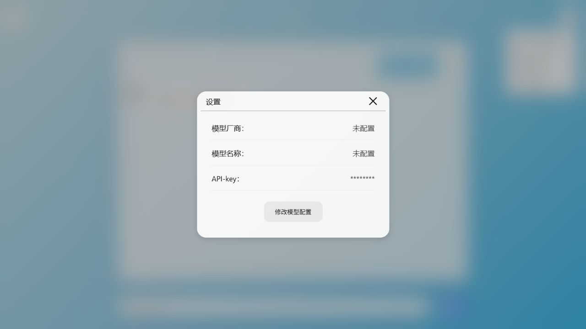
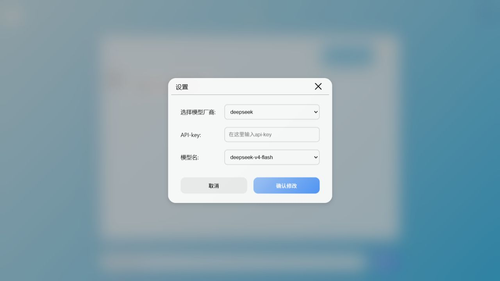
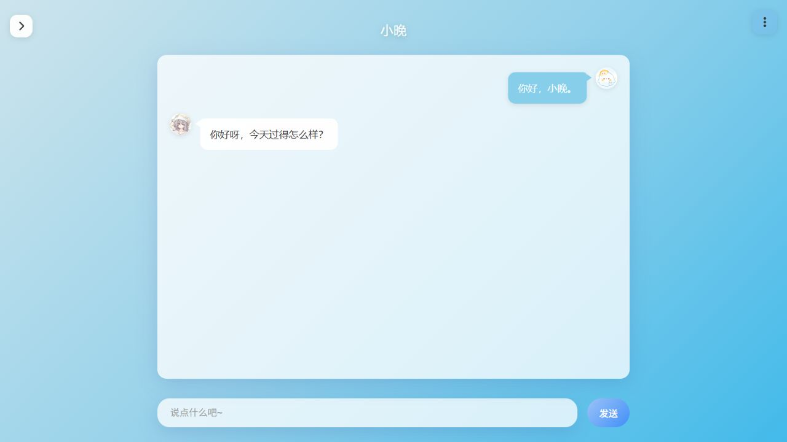
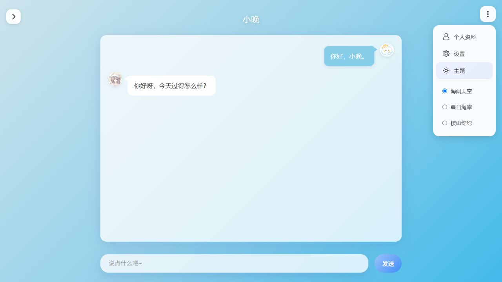
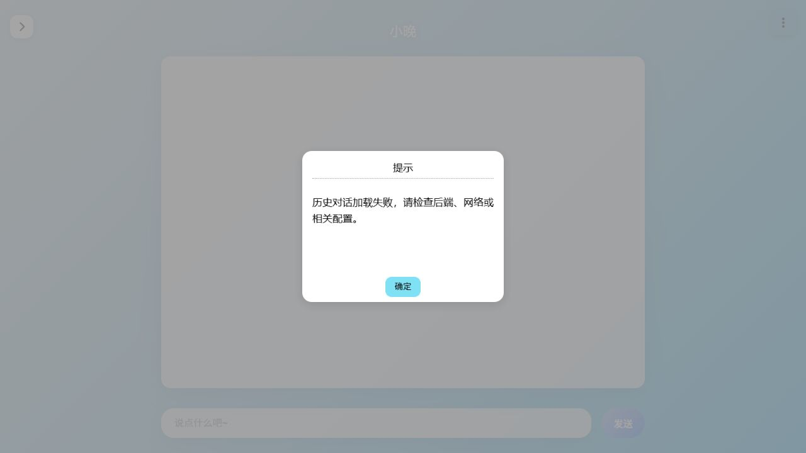
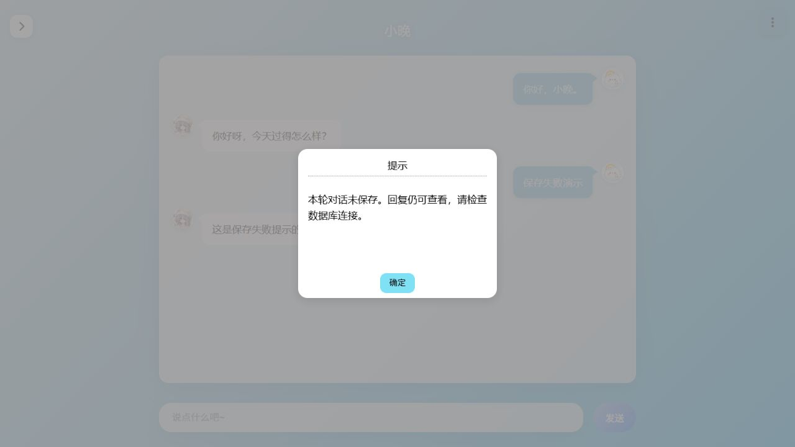

# 小晚 AI 角色对话软件用户使用说明书

版本：V1.0.0。本文对应仓库当前功能，适用于单人本地使用。

截图来自本项目构建后的实际前端，对话和接口返回使用隔离的演示数据，不含真实密钥。截图用于说明操作，不代表真实模型回答或数据库联调结果。

## 1. 软件用途

小晚提供角色化文字聊天、模型切换、历史对话加载和主题切换。后端分析用户输入，再调用外部模型生成回复；历史过长时自动整理为摘要，以供后续聊天参考。

当前只有一个共享角色和一份后端对话状态，供单人使用。菜单中的“个人资料”和空侧边栏尚未提供完整功能，当前版本没有账号、多会话管理或聊天导出功能。

## 2. 安装与配置

准备 Python 3.10+、MySQL 8+、npm，以及兼容当前 Vite 版本的 Node.js（20.19+ 的 20.x 或 22.12+）。外部模型需要对应供应商的有效 API Key 和网络连接。

在项目根目录执行：

```powershell
python -m pip install -r requirements.txt
npm --prefix frontend install
```

首次配置时，将 `backend/.env.example` 复制为 `backend/.env`；已有 `.env` 时直接编辑，保留原配置。填写实际使用的模型密钥和 MySQL 密码：

```env
DEEPSEEK_API_KEY=你的DeepSeek密钥
TONGYI_API_KEY=你的通义密钥
PASSWORD=你的MySQL密码
```

数据库默认连接 `localhost:3306`，用户为 `root`，会创建 `XiaoWan` 数据库及所需表。使用其他连接信息时，修改 `backend/config/cfg.py` 中的数据库配置。

**每次启动后端都会清空历史对话和历史摘要，这是当前版本的既定设计。** 页面刷新只重新加载本次后端运行期间保存的记录。

## 3. 启动软件

日常运行时，在项目根目录先构建前端，再启动后端：

```powershell
npm --prefix frontend run build
cd backend
python run_serve.py
```

浏览器打开 `http://127.0.0.1:8000`。修改前端源码后重新构建并刷新页面；修改后端代码或 `.env` 后重新启动后端。

开发时，先按上述方式启动后端，再在另一个终端执行：

```powershell
cd frontend
npm run dev
```

使用 Vite 显示的访问地址，通常为 `http://localhost:5173`。前端通过代理访问 8000 端口的后端接口。

## 4. 配置模型

首次进入页面时，打开右上角菜单，点击“设置”，再点击“修改模型配置”。



选择模型厂商，再明确选择一个模型名称，点击“确认修改”。后台会请求供应商验证配置；出现“模型配置验证通过并已保存！”后，关闭提示和设置界面即可聊天。



目前支持页面列出的 DeepSeek 和通义模型，实际可用性取决于供应商接口与账号权限。模型选择保存在当前浏览器中，页面再次打开时会向后端重新验证。

**弹窗中的 API-key 输入框目前没有接入后端密钥配置。** 真正使用的密钥来自 `backend/.env`；在弹窗填写密钥不会生效。

## 5. 发送消息与查看历史

在底部输入框输入文字，点击“发送”或按 Enter。等待期间发送按钮暂时锁定，界面显示输入动画。回复有多条消息时依次出现。



滚动聊天区域可查看本次运行的历史；向上滚动后，可用“回到底部”按钮返回最新消息。未配置有效模型时，发送操作会提示先配置模型。

默认历史压缩阈值为 100000 个估算 token，可在 `backend/config/cfg.py` 修改。超过阈值后，后端尝试将较早的一半记录整理为摘要并删除对应原始记录；摘要供模型继续聊天使用，界面没有摘要编辑入口。

角色名称、头像和说话风格通过 `backend/persona_config/xiaowan.py` 等人设配置文件修改，当前没有前端人设编辑器。

## 6. 切换主题

打开右上角菜单，点击“主题”，选择“海阔天空”“夏日海岸”或“樱雨绵绵”。主题立即生效，并保存在当前浏览器中。



## 7. 失败提示与处理

初始化会依次加载角色信息、恢复模型配置、加载历史。某一步请求失败或超时后，会继续其他步骤，关闭加载画面并集中显示提示。角色与历史请求超时为 15 秒，模型验证请求超时为 30 秒。



对话已经生成但写入数据库失败时，回复仍显示，同时提示“本轮对话未保存”。该回复可以查看，也暂时保留在后端内存上下文中；数据库记录没有保存，刷新页面后可能无法从历史中恢复。确认数据库连接正常后再继续使用。



| 现象 | 处理方法 |
| --- | --- |
| Vite 提示 `ECONNREFUSED 127.0.0.1:8000` | 确认后端已启动且监听 8000 端口，再刷新前端页面 |
| 8000 端口页面无法加载前端 | 确认已执行构建，存在 `frontend/dist`，并从 `backend` 目录启动服务 |
| 模型验证失败 | 检查 `.env` 中对应密钥、模型权限和供应商网络连接；查看后端日志中的具体原因 |
| 历史加载失败 | 检查后端与网络状态，恢复后刷新页面重新加载 |
| 本轮对话未保存 | 检查 MySQL 服务和连接状态；当前版本不会自动补写失败记录 |
| 重启后历史变空 | 属于既定启动行为；当前版本不提供跨启动的历史保留 |

## 8. 对应材料

安装及检查命令见根目录 [readme.md](../readme.md)，依赖许可和素材待核实事项见 [THIRD_PARTY_NOTICES.md](../THIRD_PARTY_NOTICES.md)。登记材料应统一使用“小晚 AI 角色对话软件 V1.0.0”，实际权利人、开发完成日期和素材授权需另行核实。
